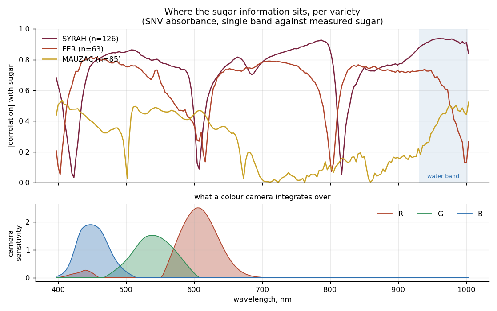
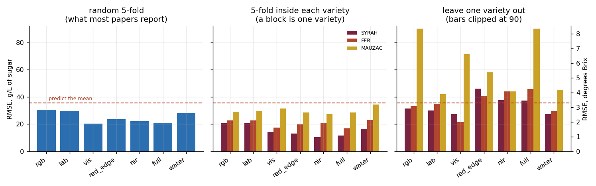
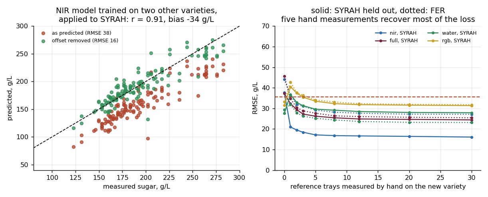
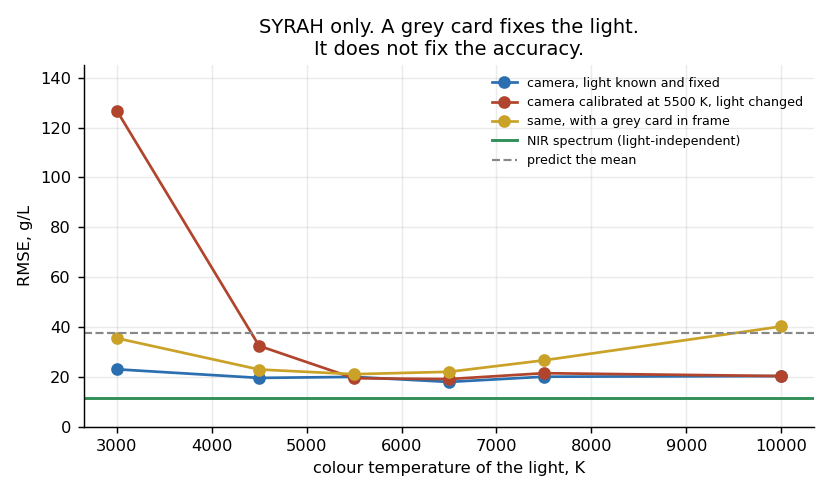
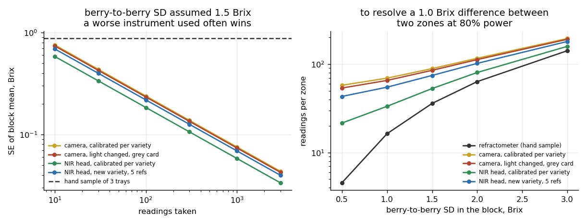
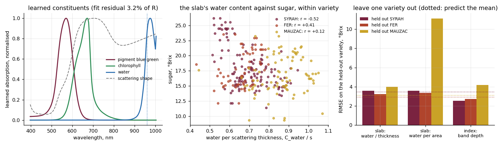

# Reading sugar off a grape

What a vineyard robot can and cannot learn about ripeness by looking — and
what it would have to carry instead.

The pitch for a vineyard robot is simple enough to draw on a napkin: it drives
the rows, looks at the fruit, reports where the sugar is. Everything hard about
it is in the word *looks*. A camera does not measure a spectrum. It collapses
one into three numbers, over a range of wavelengths that stops at about 700 nm.
Whether the pitch works depends on how much of the sugar signal is still there
after that collapse.

This repository measures it, on published data, and then follows the answer out
to the decisions it changes.

---

## The data

[Spectral dataset of grape berries from hyperspectral imaging for maturity
monitoring](https://data.mendeley.com/datasets/gjwx64sgkp) — Maxime Ryckewaert
and Carole Feilhes, Mendeley Data, CC BY (version 1 used here).

274 trays of 100 berries each, imaged by a visible/near-infrared hyperspectral
camera at 204 bands from 397 to 1003 nm, with the sugar content of the juice
pressed from each tray. Three varieties: SYRAH (126 trays), MAUZAC (85), FER
(63). Sugar spans 101 to 283 g/L — about 9.4 to 26.2 °Brix — with a standard
deviation of 35.5 g/L (3.3 °Brix).

Two features of that design govern everything below.

**The label is a batch label.** Sugar was measured on the juice of a whole
tray, so the target is already a 100-berry average. That is the quantity a
vineyard manager acts on, and it means nothing here speaks to single-berry
accuracy.

**Variety is confounded with colour.** Two varieties are red and one is white,
so any colour feature separates them trivially. A model validated by random
splitting is rewarded for recognising the grape rather than measuring it,
which is why every headline number below is also computed with a whole variety
held out.

Sugar is reported in g/L, as measured. Where °Brix is quoted it uses a single
factor of 10.8 g/L per °Brix, which is within about ±0.4 °Brix across this
range; the conversion is used for reporting only and never inside a model.

---

## What came out of it

| # | Finding | Evidence |
|---|---------|----------|
| 1 | A colour camera barely beats guessing. RMSE 30.7 g/L against 35.5 for predicting the mean. | §2 |
| 2 | Inside one variety, near-infrared roughly halves the error a camera achieves — 10.6 g/L against 20.6, or 1.0 °Brix against 1.9. | §2 |
| 3 | Nothing transfers to an unseen variety as-is. Most feature sets do worse than predicting the mean, and the worst reaches an RMSE of 216 g/L against a population mean of 189. | §2 |
| 4 | But the near-infrared failure is an *offset*, not a loss of relationship: r = 0.91 on the held-out variety, bias −34 g/L. Five hand-measured trays cut its error from 37.7 to 17.1 g/L. | §3 |
| 5 | For the white variety modelled on two reds there is no relationship to rescue (r = 0.06), and the standard spectroscopic outlier test flags 100% of those spectra. A deployed module should refuse the question rather than answer it. | §3 |
| 6 | A grey card in frame is not enough. Calibrated at 5500 K and used in open shade, a white-balanced camera still degrades to 40 g/L — worse than guessing. | §4 |
| 7 | The robot's real advantage is not accuracy, it is n. Its block mean beats a three-tray hand sample after 5 to 38 readings, and after 300 it is six times tighter than that hand sample. | §5 |
| 8 | Putting the "sugar displaces water" argument into a radiative-transfer equation does not help. A slab model with learned constituent spectra fits the reflectance to 3% and finds water where water absorbs, but its water content tracks sugar only in one variety (r = −0.90, the same as the band-depth index) and flips sign in the other two. The half-band the camera sees is not enough to separate water from thickness. | §6 |

---

## 1. Where the signal is



The upper panel is the correlation between single-band absorbance and measured
sugar, per variety. The lower panel is what a colour camera integrates over.

In the two red varieties the correlation runs high across almost the whole
range, peaking for SYRAH at 0.94 in the water absorption band near 960 nm.
That band is the physical reason near-infrared can read sugar at all: soluble
solids displace water, so a riper berry holds less water per unit volume and
the O–H overtone absorption gets shallower. Colour has no equivalent
mechanism. Anthocyanin absorption in the visible tracks pigment, and pigment
tracks ripeness only through the variety's own development — which is why it
does not survive being asked about a different variety.

The white variety is the counter-example that keeps this honest: MAUZAC's
correlation never exceeds 0.63, including in the water band. Whatever the
mechanism is doing there, it is not doing it as cleanly.

*A caveat on this figure.* The spectra are standard-normal-variate corrected,
which removes the brightness differences that come from how far a berry sat
from the lamp. SNV also forces each spectrum to sum to zero, so a region
carrying signal induces anti-correlation elsewhere and the curve overstates how
widely the information is spread. The band-restricted models in §2 and the
single-index result are the real evidence; this figure is the map.

---

## 2. Three channels against two hundred bands



Seven feature sets, from what a camera gives to what a laboratory gives:
linear sRGB; L\*a\*b\*; the visible bands; the red edge; the near-infrared; all
204 bands; and a single number — the depth of the water band, continuum-removed
— included to test whether a 204-band model does anything a one-line physical
index cannot.

Under **random 5-fold** validation, the number most papers report:

| features | RMSE g/L | °Brix | R² |
|---|---|---|---|
| rgb | 30.7 | 2.84 | 0.25 |
| lab | 29.7 | 2.75 | 0.30 |
| visible | 20.5 | 1.90 | 0.67 |
| near-infrared | 22.3 | 2.06 | 0.60 |
| all 204 bands | 21.1 | 1.96 | 0.64 |
| water band only | 28.0 | 2.59 | 0.38 |
| *predict the mean* | *35.5* | *3.29* | *0* |

A colour camera reaches 30.7 against a baseline of 35.5. That is a ratio of
performance to deviation of 1.16, which in any spectroscopic laboratory is
called useless. Spectra reach 21, which is a ratio of 1.7 — usable for
screening, not for a picking date.

**Inside a single variety** — the realistic case, since a block is one variety
and can be calibrated on itself — the spectra pull further ahead. On SYRAH the
near-infrared model reaches 10.6 g/L, just under 1 °Brix, while the camera
stays at 20.6 g/L. That factor of two is the honest measure of what the
infrared half of the spectrum is worth, and it is the number a robot
specification should be written against.

**Leave one variety out** is where it falls apart. Every bar in the third
panel is at or above that variety's own standard deviation, except the visible
bands and the water index on the two reds. Trained on SYRAH and FER, the
full-spectrum model predicts MAUZAC at 215.9 g/L RMSE, and the RGB model at
203.1 — a model asked about a white grape after seeing only red ones does not
degrade gracefully, it produces confident nonsense.

Note also which models transfer and which do not. Near-infrared and
full-spectrum are the *best* in-domain and the *worst* out of it. That looks
like a straightforward case of capacity buying accuracy and costing
generalisation. Section 3 shows it is not.

---

## 3. Offset or scatter — and how many berries you still have to press



There are two ways for a calibration to fail on a new variety, and they call
for opposite responses.

**An offset** means every prediction is shifted but the ranking is intact. One
reference measurement fixes it.
**Scatter** means the relationship is gone. No number of reference
measurements fixes it; the calibration has to be rebuilt.

Separating them changes the reading of §2 completely:

| model | held out | raw RMSE | offset removed | bias | r | after 5 refs |
|---|---|---|---|---|---|---|
| near-infrared | SYRAH | 37.7 | **15.9** | −34.2 | **0.91** | 17.1 |
| near-infrared | FER | 44.1 | 26.4 | +35.4 | 0.56 | 29.2 |
| all bands | SYRAH | 37.3 | 23.9 | −28.6 | 0.78 | 26.2 |
| visible | SYRAH | 27.3 | 26.7 | +5.7 | 0.76 | 29.4 |
| water index | SYRAH | 27.5 | 27.3 | −3.5 | 0.90 | 29.6 |
| near-infrared | MAUZAC | 44.0 | 37.5 | −23.0 | **0.06** | 41.1 |
| all bands | MAUZAC | 215.9 | 51.6 | −209.7 | −0.55 | 56.0 |

The near-infrared model was the worst performer in §2 on held-out SYRAH and is
the best here by a wide margin. It had learned the relationship — correlation
0.91, better than any other feature set — and lost only the intercept. Remove
that one number and its error drops to 15.9 g/L, better than anything else
achieves in or out of domain. Five trays pressed by hand recover almost all of
it; twenty adds almost nothing.

**MAUZAC refuses to be rescued.** Correlation 0.06 for the near-infrared model,
0.02 for the water index, −0.55 for the full-spectrum one. Offset correction
leaves it worse than its own standard deviation. Trained on red grapes, the
model has no relationship to shift.

That distinction has to be made *before* the answer is given, not after, and
the standard tools do make it. Hotelling's T² inside the model's latent space
and the Q residual orthogonal to it, both thresholded at the 95th percentile of
the training data, flag **100%** of MAUZAC spectra for every multi-band model.
The held-out red varieties are flagged at 2–60%. So the module can say "this
is not a grape I was calibrated on" instead of returning 203 g/L. The
one-dimensional water index is the exception: with a single latent direction
its diagnostics are weak, and it flags only 19% — a small model is harder to
police than a large one.

---

## 4. The lab-to-vineyard step



Everything above uses reflectance, which is a property of the berry. A camera
in a row does not measure reflectance. It measures the product of the berry's
reflectance with whatever light fell on it, and a vineyard offers direct sun
near 5500 K, overcast around 6500 K, and open shade under blue sky up to
10 000 K, along with whatever the auto-exposure decides.

Working entirely inside SYRAH — the most favourable case for colour — and
putting the light back in:

| | calibrated and used under the same light | calibrated at 5500 K, used at 3000 K | at 10 000 K |
|---|---|---|---|
| raw camera | 18–23 | 126.9 | 20.3 |
| with a grey card in frame | 18–20 | 35.5 | 40.2 |
| near-infrared spectrum | 11.4 | 11.4 | 11.4 |

An uncalibrated camera moved from midday sun to warm early-morning light
returns 127 g/L — three and a half times worse than saying nothing. A grey card
recovers most of that, which is the argument for putting a reference target on
the machine. But it does not recover all of it: at 10 000 K the white-balanced
camera still reads 40.2 g/L, worse than this variety's standard deviation of
37.4. The remaining error is exposure gain, which a colour reference does not
correct, and the imperfection of a single diagonal correction across a broad
channel.

The conclusion is not "use a grey card". It is that a colour calibration must
be built across the range of light it will meet, and re-checked when that
range changes. A spectral head with per-spectrum normalisation needs none of
this, because it never measured the light in the first place.

---

## 5. Where a robot actually wins



Sections 1–4 measure how accurate one reading is. A picking decision is not
made on one reading — it is made on the mean of a block, whose standard error
from n samples is

```
SE = sqrt( (sigma_block^2 + sigma_meas^2) / n )
```

Both terms fall as 1/n. A person presses about three trays with an instrument
good to 0.2 °Brix. A robot takes hundreds with an instrument good to 1.9. The
robot wins, and not narrowly: with a berry-to-berry spread of 1.5 °Brix, three
hand-pressed trays give a standard error of 0.87 °Brix, while 300 camera
readings give 0.13.

**Readings needed before the robot's block mean beats a three-tray hand
sample:**

| berry-to-berry SD | camera | NIR head, per-variety | NIR head, new variety + 5 refs |
|---|---|---|---|
| 0.5 °Brix | 38 | 15 | 29 |
| 1.0 | 13 | 7 | 11 |
| 2.0 | 6 | 4 | 5 |
| 3.0 | 5 | 4 | 4 |

The mediocre instrument catches up almost immediately, because at any
realistic block variability the biological spread dominates the instrument
error and the only thing that matters is how many berries you looked at.

The picture inverts for the other question a grower asks — *which end of the
block is ahead?* There the instrument error must be beaten down separately in
each zone. To resolve a 1 °Brix difference at 80% power with a berry-to-berry
spread of 1.5 °Brix takes 36 readings per zone with a refractometer, 53 with a
near-infrared head and 85–89 with a camera. All three are feasible for a
machine and only the first is feasible for a person, so the robot still wins —
but by a factor of two, not a factor of ten, and only if it aggregates.

**σ_block is the one number this dataset cannot supply.** Its 274 trays span
three varieties and a whole season, not one block on one day, so the table
sweeps it rather than asserting it. Anyone specifying a machine should measure
it in their own vineyard first; it is a morning's work with a refractometer and
it decides the whole design.


---

## 6. The physics, written as an equation — and what it does not buy



The mechanism behind every near-infrared result above is that sugar
displaces water and the water absorption near 960 nm gets shallower. §1 read
that as an index. Here it is put into the equation it comes from: a berry
surface is a scattering, absorbing layer, and its reflectance obeys the
finite-thickness Kubelka–Munk solution

R = 1 / (a + b·coth(b·S·d)),  a = 1 + K/S,  b = √(a² − 1),

with the absorption K·d a sum over constituents — a pigment below 600 nm, a
pigment between 600 and 760 nm, water above 880 nm — whose specific spectra
are small networks of wavelength, learned jointly with per-tray contents and
a per-tray scattering thickness from reflectance alone. No sugar value
enters the fit. The point of the thickness term is that water *per unit
thickness* is what sugar displaces; an index cannot separate the two.

The model does what it is asked physically: it reproduces the 274 spectra
to 3% and the learned water spectrum rises where the 960 nm band is (left
panel). It does not do what the argument promised:

| variety | r(sugar, slab water / thickness) | r(sugar, slab water per area) | r(sugar, band-depth index) |
|---|---|---|---|
| SYRAH | −0.52 | **−0.90** | **−0.90** |
| FER | +0.41 | +0.23 | −0.72 |
| MAUZAC | +0.12 | +0.36 | −0.02 |

In the one variety where the water signal is strong the slab's water
content is exactly as good as the index. In the other two its sign flips,
where the index at least keeps the physical sign. Calibrated on two
varieties and applied to the third, the slab features are worse than
predicting the mean on every variety; the index survives on SYRAH (RMSE
27.5 g/L against 37.3 for the mean) and on nothing else.

The reason is in the data, not the equation. The camera stops at 1003 nm,
in the middle of the 960 nm band: the model sees half a band and a plateau,
and from those it cannot tell "less water" from "thinner tissue" — the two
trade against each other in the fit, and which way they trade depends on
the variety's skin. The continuum-removed index is a cruder measurement of
the same physics, and cruder is more robust here. This is the honest
version of §1's claim: the mechanism is real, and the instrument does not
reach far enough to exploit it properly. A head that reaches 1450 nm would
give the slab model a whole band, and this dataset cannot say what it would
then do.

---

## Verification

Ten checks run as a suite, all passing (two need PyTorch and are skipped without it):

- the colour matching functions peak where the CIE 1931 functions do (ȳ at
  555 nm, z̄ at 446 nm)
- camera sensitivity beyond 750 nm is under 1% of peak — the mechanical reason
  RGB cannot reach the water band, independent of any model
- a flat 18% reflector comes out neutral under every illuminant tested, which
  is what makes the illumination experiment a statement about the light rather
  than about a bug in the colour pipeline
- SNV output has zero mean and unit deviation per spectrum
- the water band is an absorption feature and shallows as sugar rises, in both
  red varieties (r < −0.4)
- random-split full-spectrum RMSE is below 75% of the baseline deviation, and
  leave-MAUZAC-out RMSE is above it — the central finding, pinned so a refactor
  cannot quietly erase it
- the transfer failure is a shift for SYRAH (r > 0.8) and an absence of
  relationship for MAUZAC (|r| < 0.4)
- the slab model's reflectance reduces to S·d/(1 + S·d) when absorption
  vanishes and to 1/(a + b) when the layer is optically thick, and every
  learned constituent is zero outside its physical window

---

## What this does not show

- **No field images.** The berries were imaged on trays under controlled
  illumination. §4 puts the light back in analytically; it does not put back
  occlusion, motion blur, distance, view angle, dust, or the fact that a camera
  in a row sees the sun-exposed outside of a bunch, which is riper than the
  inside. Every one of those makes the camera worse, none makes it better.
- **Three varieties, one region, one instrument.** The leave-one-variety-out
  result rests on three varieties, one of which is the only white. It supports
  "colour does not transfer across varieties"; it cannot say how much of the
  near-infrared offset would persist across a fourth.
- **No single-berry ground truth.** Every label is a 100-berry average, so the
  accuracies here are tray accuracies. Per-berry error is larger by an unknown
  factor.
- **1003 nm is the edge.** The stronger water overtone at 1450 nm and the
  sugar-specific combination bands beyond 1600 nm are outside this camera's
  range. A head that reaches them should do better than anything measured here,
  and this dataset cannot say by how much.
- **σ_block is assumed, not measured**, as §5 states of itself.

---

## Source code

The core is public, in `src/`:

| file | what it is |
|---|---|
| `data.py` | loader, SNV, Brix conversion |
| `camera.py` | the camera model: CIE matching functions, sensor curves, illuminants, water-band depth |
| `exp1_rgb_vs_nir.py` | feature sets, the three validation schemes, the baseline |
| `exp2_transfer.py` | offset-vs-scatter decomposition and the outlier test |
| `exp5_km_pinn.py` | the finite-thickness Kubelka–Munk slab with learned constituent spectra (PyTorch) |
| `tests/test_all.py` | the ten checks above |

The dataset is CC BY and is downloaded as described in `data/SOURCE.md`;
it is not redistributed here. The illumination and sampling experiments
(exp3, exp4) and the figure scripts are held privately.

---

## Licence

Documentation and figures: CC BY 4.0. The underlying dataset is CC BY and
belongs to its authors, cited above; please cite them rather than this page if
you use it.
